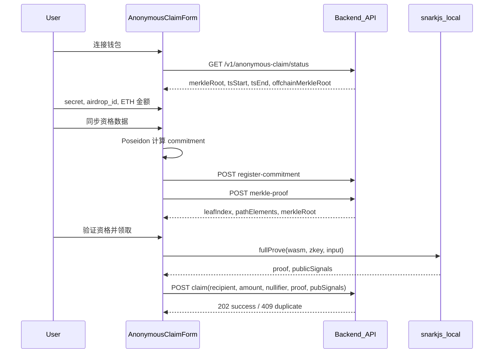

# 匿名申领开发手册（anonymous_claim 主路径）

本文面向前后端开发与测试，说明产品形态、组件职责、数据流、环境配置、排障与回归清单。协议级约定与 public signals 表见 [ZK申领端到端.md](./ZK申领端到端.md)。

## 1. 产品与角色

| 角色 | 使用方式 |
|------|----------|
| 普通用户 | 使用 `frontend/app/claim/page.tsx` 默认流程：连接钱包 → 密钥/活动编号 → **领取金额（ETH）** → **同步资格数据** → **验证资格并领取**。不手填 Merkle 路径与 wei。 |
| 开发者 / 运维 | 展开 **高级选项**：手动编辑 `merkle_root`、`leaf_index`、`merkle_path`、wei 金额、`ts_start` / `ts_end`；可使用「仅拉取 Merkle 路径」单独调试。 |

扩展路径 `POST /v1/claim/propose`（`anti_sybil_verifier`）与主路径独立，勿在同一页面混用两套 publicSignals。

## 2. 页面与组件

| 文件 | 职责 |
|------|------|
| [frontend/app/claim/page.tsx](../frontend/app/claim/page.tsx) | 页面壳：活动标题/副文案（[claimCampaign.ts](../frontend/config/claimCampaign.ts)）、隐私说明（主色 `#0A2540`）。 |
| [frontend/features/claim/AnonymousClaimForm.tsx](../frontend/features/claim/AnonymousClaimForm.tsx) | 申领终端：`config` → `generating` → `success` / `error`；消费完整 `GET status` 展示资金池与窗口；用户向错误与「排查说明」折叠。 |
| [frontend/features/claim/components/ClaimPoolSummary.tsx](../frontend/features/claim/components/ClaimPoolSummary.tsx) | 池内余额、累计已领、次数、剩余（wei→ETH）、时间窗与人类可读时间、Merkle 根与链下根；`source === unavailable` 时提示合约未配置。 |
| [frontend/features/claim/components/ClaimWalletBar.tsx](../frontend/features/claim/components/ClaimWalletBar.tsx) | 钱包地址与链 ID 展示（[chainDisplay.ts](../frontend/lib/chainDisplay.ts)）。 |
| [frontend/features/claim/components/ClaimStepIndicator.tsx](../frontend/features/claim/components/ClaimStepIndicator.tsx) | 四步指引：连接 → 同步资格 → 生成证明 → 提交结果。 |
| [frontend/features/claim/claimUiUtils.ts](../frontend/features/claim/claimUiUtils.ts) | 领取窗口阶段、wei 格式化展示（非密码学）。 |
| [frontend/hooks/useAnonymousClaimProof.ts](../frontend/hooks/useAnonymousClaimProof.ts) | `snarkjs.groth16.fullProve` + `POST /v1/anonymous-claim/claim`。 |
| [frontend/lib/zk/anonymousClaimWitness.ts](../frontend/lib/zk/anonymousClaimWitness.ts) | Poseidon 与 `buildAnonymousClaimCircuitInput`。 |
| [frontend/lib/zk/claimAmount.ts](../frontend/lib/zk/claimAmount.ts) | `parseEthInputToWei` / `formatWeiToEth`（18 位小数）。 |
| [frontend/lib/zk/localSecret.ts](../frontend/lib/zk/localSecret.ts) | `generateRandomSecretDecimal`：本机随机域元素，不上传。 |

### 2.1 `GET /v1/anonymous-claim/status` 与界面

| 字段 | 界面用途 |
|------|----------|
| `totalBalance` | 池内余额（ETH） |
| `totalClaimed` | 累计已领取（ETH） |
| `claimCount` | 领取次数 |
| `remainingBalance` | 剩余可领（统计，ETH） |
| `merkleRoot` / `offchainMerkleRoot` | Merkle 根对比与不一致告警 |
| `tsStart` / `tsEnd` | 时间窗 + 未开始/进行中/已结束标签 |
| `source` | `onchain` / `unavailable`：后者时提示无法从链上读池与时间窗 |

前端 `API_CONFIG.baseURL` 默认 `NEXT_PUBLIC_API_BASE_URL`（见 [client.ts](../frontend/lib/api/client.ts)）；若仓库示例中曾使用其他变量名，以代码为准。

## 3. 数据流（时序）

## 4. 前端环境变量

| 变量 | 说明 |
|------|------|
| `NEXT_PUBLIC_API_BASE_URL` | 后端根 URL（见 [frontend/lib/api/client.ts](../frontend/lib/api/client.ts) 中 `API_CONFIG.baseURL`）。 |
| `NEXT_PUBLIC_ANONYMOUS_CLAIM_WASM_PATH` | 浏览器可访问的 wasm 路径，默认 `/circuits/build/anonymous_claim.wasm`。 |
| `NEXT_PUBLIC_ANONYMOUS_CLAIM_ZKEY_PATH` | zkey 路径，默认 `/circuits/build/anonymous_claim_final.zkey`。 |
| `NEXT_PUBLIC_CLAIM_CAMPAIGN_TITLE` | 可选，申领页主标题（默认见 `claimCampaign.ts`）。 |
| `NEXT_PUBLIC_CLAIM_CAMPAIGN_DESC` | 可选，申领页副标题/说明段落。 |

复制构建产物到 `frontend/public/circuits/build/` 的方式见 [frontend/public/circuits/build/README.txt](../frontend/public/circuits/build/README.txt) 与 [circuits/README.md](../circuits/README.md)。

## 5. API 契约摘要

请求/响应字段细节与 7 元 `pubSignals` 顺序见 [ZK申领端到端.md](./ZK申领端到端.md)。

- **claim** 请求体：`recipient`、`amount`（wei 字符串）、`nullifier`（与 `pubSignals[1]` 一致）、`proof`（`pi_a`/`pi_b`/`pi_c`）、`pubSignals`（长度 7）。

## 6. 错误与排障

| 现象 | 可能原因 | 处理 |
|------|----------|------|
| 页面首行提示无法获取活动信息 | 后端未启动或 API 根地址错误 | 启动 backend；展开「查看排查说明」；核对 `NEXT_PUBLIC_API_BASE_URL` 与后端端口 |
| 同步资格失败 / merkle-proof 404 | commitment 未在链下树注册 | 先执行「同步资格数据」（含 register），或检查后端 `merkleTree.service` 匿名树 |
| Merkle 根与链上不一致 | 合约 `immutable merkleRoot` 与链下树不同步 | 运维对齐部署根与注册顺序；见只读卡片告警文案 |
| 领取失败 Nullifier 已用 | 同一 secret+airdrop 重复领取 | 预期行为；换批次或新密钥 |
| 证明生成失败 / wasm 404 | 未放置 wasm/zkey 或路径错误 | 按 `circuits/README` 构建并复制到 `public/circuits/build` |
| CORS | 前端与后端域名不一致 | 后端配置 `cors` 允许前端 origin |

## 7. 视觉与文案规范（V6）

- 主色：`#0A2540`；成功：`#2D8A39`；警示：`#D93025`；背景辅助：`#F8FAFC` / 文字 `#64748B`。  
- 禁止使用蓝紫渐变或偏紫的蓝色作为大面积强调。  
- ZK 加载：使用纯深蓝脉冲等现有 [PrivacyShield](../frontend/features/zk/PrivacyShield.tsx) 组件，避免娱乐化渐变。  
- 隐私：明确「本地算力加密」「密钥不离端」。

## 8. 测试清单

### 自动化

- 后端：`trustaid-platform/backend` 执行 `npm run test:all`，包含 [anonymousClaimRoutes.test.js](../backend/tests/anonymousClaimRoutes.test.js)、[anonymousClaim.service.test.js](../backend/tests/anonymousClaim.service.test.js)。

### 手动回归（前端）

1. 连接钱包，确认底部显示已连接。  
2. 点击「生成本地密钥」，确认输入框出现十进制域元素。  
3. 填写活动编号，领取金额输入 `1`（ETH），点击「同步资格数据」，确认显示「已同步」与 leaf 序号。  
4. 点击「验证资格并领取」，确认进入生成中态；成功或失败页符合预期。  
5. 展开「高级选项」，确认可编辑 wei 与 Merkle 原始字段。  
6. 断开后端，刷新页面，确认出现「无法获取活动信息」及可展开的排查说明（主文案不再默认暴露环境变量名）。
7. 在合约可用时，确认「资金池与活动时间」卡片展示池内余额、领取次数与窗口状态标签。

---

维护者更新本手册时，请同步检查 [ZK申领端到端.md](./ZK申领端到端.md) 中的协议表是否仍与 `AnonymousClaim.sol` / `anonymous_claim.circom` 一致。
